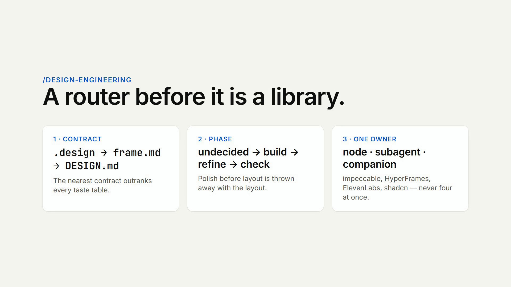
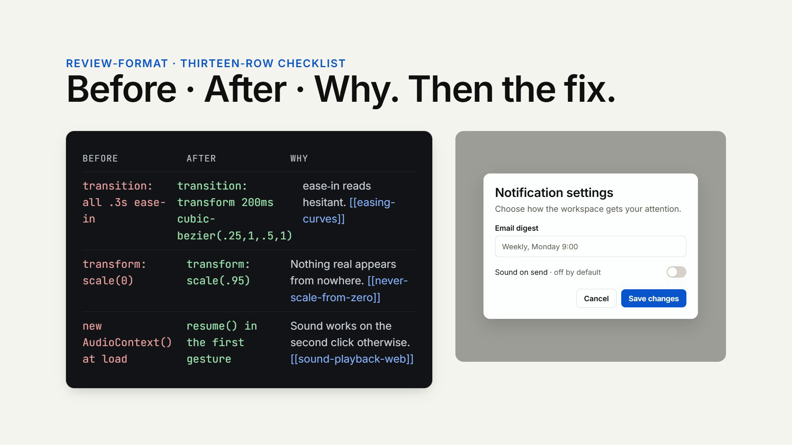
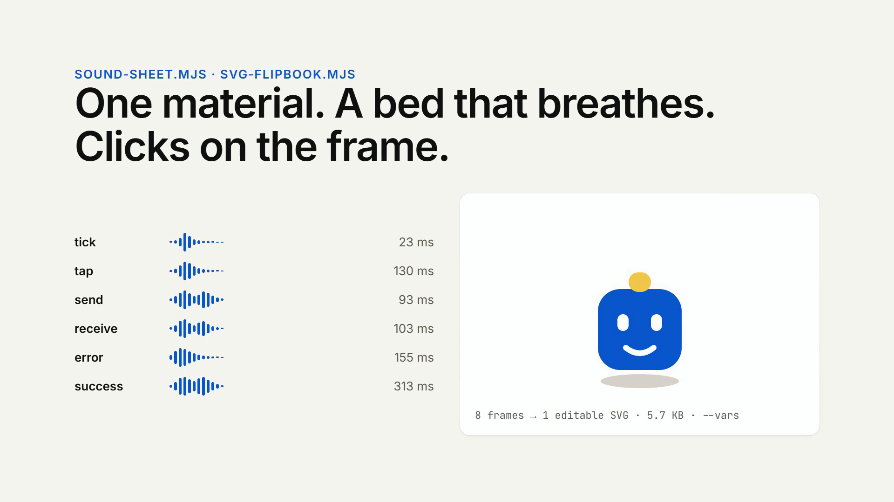
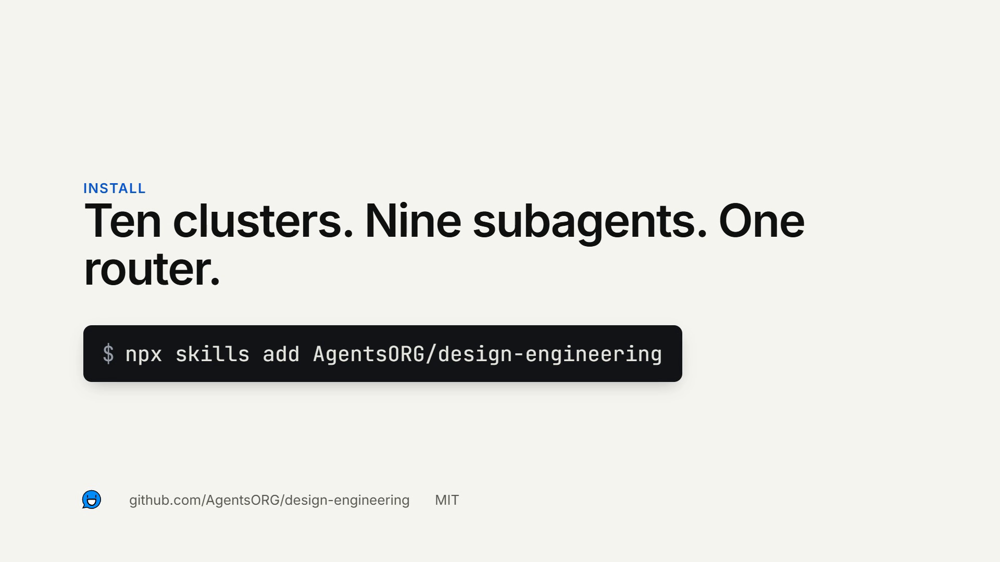

<p align="left">
  <picture>
    <source media="(prefers-color-scheme: dark)" srcset="docs/brand/agents-dark-bg.svg">
    
  </picture>
</p>

# design-engineering

[](https://skills.sh/AgentsORG/design-engineering)
[](https://github.com/AgentsORG/design-engineering/actions/workflows/lint.yml)
[](LICENSE)

Design engineering for AI agents — the invisible details that make UI feel right. Distills [Emil Kowalski](https://emilkowal.ski) (animation), [Benji Taylor](https://benji.org) (delight + [Agentation](https://www.agentation.com)), [Jakub Antalik](https://transitions.dev) (transitions), [James Frewin](https://guidelines.sh) (guidelines), [Vercel](https://vercel.com/design/guidelines) (web-interface rules), [Ben DC](https://github.com/bendc/frontend-guidelines) (CSS conventions), [Google Labs design.md](https://github.com/google-labs-code/design.md) (design-token format), [lucide-animated](https://lucide-animated.com) (icon animation), [DiceBear](https://www.dicebear.com) (avatars), [Index](https://index.how) (design vocabulary), Apple's audio-haptic principles, [Josh Comeau](https://www.joshwcomeau.com/react/announcing-use-sound-react-hook/) (use-sound), and [bruno / superfx](https://superfx.co) (launch-video sound) into one navigable skill graph.

Not a tutorial. Not a doc site. **A working memory the agent loads** when you're reviewing UI code, picking an easing curve, designing a component, deciding whether a send button should make a sound, or asking "why does this feel flat?"

```bash
npx skills add AgentsORG/design-engineering
```

## Demo


Twelve seconds, made with the skill's own rules and tools. [Watch the MP4 with sound](docs/demo/design-engineering-demo.mp4). It is scored in the register measured from OpenAI's *Refreshed.* and *Introducing GPT-5* films: a warm sub-heavy bed in F that carries the piece, dry clicks 10–20 dB under it on every stepped reveal (a glyph flipbook, words streaming in, a table filling cell by cell), a low thud when something big settles, and the sub dropping out for half a second before the modal lands. The whole soundtrack is *derived from the motion* — nothing is picked from a library.

| What you see | What made it |
|---|---|
| The composition | [`docs/demo/hyperframes/index.html`](docs/demo/hyperframes/index.html), a [HyperFrames](https://www.skills.sh/heygen-com/hyperframes/hyperframes) project in the shape HeyGen uses for its own launches: one paused GSAP timeline, `data-start` clips, a [storyboard](docs/demo/hyperframes/STORYBOARD.md) with the act table and audio cue map, a [seam ledger](docs/demo/hyperframes/ledger.json), `check` passing with zero layout or contrast findings. Reveals are stepped, not tweened — seven frames a glyph, 110 ms a word, 210 ms a cell — and only placement eases (`power3.out`). `easing-curves`, `duration-table`, `launch-video-seams`. |
| The sound | One stereo stem rendered by `scripts/sound-sheet.mjs` from a [cue sheet](docs/demo/hyperframes/assets/sfx/cues.json): a bed with its act-by-act gain arc, one dropout, and ducking under every thud, plus 72 onsets from 22 cues, each with its contact frame and its box on the canvas. Size sets pitch, x sets pan, y sets brightness, a stepped reveal sets the click cadence. The six product one-shots in the same folder come from the same voices (`--family`). The register's numbers — bed root, click decay, hit level under the sub, silence as punctuation — were measured from the two OpenAI films with the scripts in [`docs/research/launch-register/`](docs/research/launch-register/). `sound-from-motion`, `launch-video-sound`, `sound-motion-sync`. |
| The mascot | Eight flat SVG frames through `scripts/svg-flipbook.mjs --vars`: one 5.7 KB file, colors lifted to CSS variables, driven by the composition timeline. |

Re-render it yourself:

```bash
cd docs/demo/hyperframes && npm run check && npm run render
```

## What `/design-engineering` produces

Frames from the demo, each a real output shape of the skill.

<table>
<tr>
<td width="50%"><br><sub><b>The router.</b> Before reading anything, <code>/design-engineering</code> resolves the design contract, classifies the phase, and hands the job to one owner — a node, a subagent, or an installed companion. <code>references/meta/skill-router.md</code></sub></td>
<td width="50%"><br><sub><b>A review, then the fix.</b> Every UI review is a Before | After | Why table scanned against the thirteen-row checklist; the modal on the right is what the After column ships. <code>review-format</code>, <code>review-checklist</code></sub></td>
</tr>
<tr>
<td width="50%"><br><sub><b>Sound and vectors.</b> A six-sound family from the same voices that score the video — dry clicks and a low thud on the bed's root — rendered by <code>sound-sheet.mjs</code>, and a mascot flipbook from <code>svg-flipbook.mjs</code>. <code>sound-from-motion</code>, <code>launch-video-sound</code>, <code>video-to-vector-pipeline</code></sub></td>
<td width="50%"><br><sub><b>Ten clusters, nine subagents, one router.</b> Installs into any agent that reads a <code>SKILL.md</code>; slash commands and subagents ship for Claude Code, Cursor, and Codex.</sub></td>
</tr>
</table>

## Benchmarks: with and without the skill

The skill ships its own [DesignBench](https://github.com/webpai/designbench)-style fixtures — generation, edit, and repair tasks with deterministic `must_match` / `must_not_match` rules tied to the review checklist — and a runner that scores real outputs. Same model in both arms; the only difference is whether the agent read `SKILL.md` and followed its routing before answering. Scoring looks only at the code each arm shipped, not the prose around it.

| arm | rules passed | fixtures fully clean |
| --- | --- | --- |
| Sonnet, own knowledge | 32 / 36 (89%) | 7 / 10 |
| Sonnet + `/design-engineering` | 35 / 36 (97%) | 9 / 10 |

Run of 2026-09-05, ten scorable fixtures, one sample each — a floor check, not a leaderboard. Per-fixture results, every rule each arm missed, and all twenty raw outputs are in [`evals/results/2026-09-05-sonnet/`](evals/results/2026-09-05-sonnet/REPORT.md). What the skill fixed: the card-hover edit (named transition properties, a `hover: hover` guard, a smaller lift), the dark-mode repair (a lifted surface instead of `#000`), the icon toolbar (`hover: hover`). What it still missed: one login form shipped 15 px inputs, which zoom on iOS.

<details>
<summary><b>One fixture, both arms</b> — <code>edit-hover-01</code>: "Make the card lift on hover."</summary>

Input:

```css
.card { transition: all 0.3s ease-in; }
.card:hover { transform: translateY(-4px); box-shadow: 0 16px 32px rgba(0,0,0,0.3); }
```

Without the skill (3 of 5 rules):

```css
.card {
  transition: transform 0.2s ease-out, box-shadow 0.2s ease-out;
}
.card:hover {
  transform: translateY(-4px);
  box-shadow: 0 16px 32px rgba(0,0,0,0.3);
}
```

With the skill (5 of 5):

```css
.card {
  transition:
    transform 160ms cubic-bezier(0.25, 1, 0.5, 1),
    box-shadow 160ms cubic-bezier(0.25, 1, 0.5, 1);
}

@media (hover: hover) {
  .card:hover {
    transform: translateY(-1px);
    box-shadow:
      0 1px 1px rgba(17, 17, 17, 0.04),
      0 2px 4px rgba(17, 17, 17, 0.04);
  }
}

@media (prefers-reduced-motion: reduce) {
  .card {
    transition: box-shadow 160ms cubic-bezier(0.25, 1, 0.5, 1);
  }

  .card:hover {
    transform: none;
  }
}
```

</details>

Reproduce: produce the two arms with any agent that can read files (prompts are the fixture rows in [`design-bench.jsonl`](skills/design-engineering/evals/design-bench.jsonl)), then:

```bash
node evals/run-bench.mjs evals/results/<run>
```

The eve evals in `evals/` are the other half: five `defineEval()` checks (review format, motion values, sound values, the generated-modal floor, and routing) run with `npm run eval`. The methodology behind both is in `references/meta/design-benchmarks.md`.

## The four primitives

Since v2.0.0 the repo is organized around four primitives, each owned by an open spec, each independently useful:

| Primitive | What it is | Where | Spec |
|---|---|---|---|
| **Knowledge** | The skill graph — 107 atomic, wikilinked nodes in 10 themed clusters, plus three generation scripts | `skills/design-engineering/` | [Agent Skills](https://agentskills.io/specification) |
| **Package** | The portable plugin — one manifest, portable skills, namespaced client extensions | `plugin.json` + `skills/` | [Agent Plugins v1.0.0](https://agent-plugins.org/) |
| **Runtime** | A durable agent that *runs* the knowledge — root agent, nine specialist subagents, scored evals | `agent/` + `evals/` | [eve](https://eve.dev/) |
| **Client extensions** | Per-host adapters — subagents, slash commands, host manifests, shadcn registry | `agents/`, `commands/`, `.claude-plugin/`, `.codex-plugin/`, `.cursor-plugin/`, `.plugin/`, `registry.json` + `r/` | per host |

The knowledge is the core; everything else is a delivery mechanism for it. `plugin.json` declares the client extensions under reverse-domain namespaces (`com.anthropic.claude-code`, `com.openai.codex`, `com.cursor.editor`, `dev.vercel.plugins`, `dev.eve.agent`) so any Agent Plugins client can discover what this repo ships and ignore what it doesn't implement.

## Install

The fastest path is the one-liner at the top — `npx skills add AgentsORG/design-engineering`. It uses the [skills.sh](https://skills.sh) CLI to install into your detected agent (Claude Code, Cursor, Windsurf, Codex, Gemini, Cline, Aider, and [18+ others](https://www.skills.sh/agent)). The CLI prompts for scope (project vs. global) and method (symlink vs. copy).

### Plugins CLI (Claude Code + Cursor + Codex)

Install the full plugin bundle — skill graph, nine workflow subagents, and slash commands — in one step via [vercel-labs/plugins](https://github.com/vercel-labs/plugins):

```bash
npx plugins add AgentsORG/design-engineering

# Dry run — see skills, agents, and commands before installing
npx plugins discover AgentsORG/design-engineering
```

Restart your agent tools after install. Slash commands (when your host supports them) include `/design-engineering:review-ui`, `/design-engineering:motion-audit`, `/design-engineering:scan-ai-tells`, `/design-engineering:agentation-fix`, `/design-engineering:apply-design-md`, `/design-engineering:fork-pov`, `/design-engineering:sound-pass`, `/design-engineering:svg-create`, and `/design-engineering:svg-animate`.

### Per-agent install

The repo ships host manifests so you can install via each agent's native plugin system:

**Claude Code** — `.claude-plugin/marketplace.json` + `.claude-plugin/plugin.json`; skills under `skills/` auto-discover.

```bash
/plugin marketplace add AgentsORG/design-engineering
/plugin install design-engineering
```

**Codex** — `.codex-plugin/plugin.json` with the full `interface` block.

```bash
codex plugin marketplace add AgentsORG/design-engineering --sparse .codex-plugin --sparse skills
```

**Cursor** — `.cursor-plugin/plugin.json`; install via the Cursor Marketplace or `Settings → Plugins → Load unpacked`.

All manifests share `name`, `version`, `description`, `author`, `homepage`, `repository`, and `license`; the root `plugin.json` is canonical and CI enforces version parity across all six plus `SKILL.md`.

### shadcn CLI

The repo doubles as a [shadcn registry](https://ui.shadcn.com/docs/registry), so a frontend project can pull the skill — or just its motion tokens — with the CLI it already has:

```bash
# The full skill graph → .agents/skills/design-engineering/
npx shadcn@latest add https://raw.githubusercontent.com/AgentsORG/design-engineering/main/r/design-engineering.json
```

Four items ship:

| Item | Installs | Into |
|---|---|---|
| `design-engineering` | The full skill graph (markdown, eval fixtures, and both scripts) | `.agents/skills/design-engineering/` |
| `design-engineering-agents` | Nine subagents + nine slash commands | `.claude/agents/`, `.claude/commands/` |
| `design-engineering-design-file` | The starter `.design` contract | `.design` at project root |
| `design-engineering-motion` | Motion tokens as theme CSS variables | your global CSS |

Swap the filename in the URL for any of them. The motion item is the lightest way in — four easing curves and a duration scale, no skill install:

```bash
npx shadcn@latest add https://raw.githubusercontent.com/AgentsORG/design-engineering/main/r/design-engineering-motion.json
```

That gives you `--ease-out-quart`, `--ease-out-expo`, `--ease-in-out`, `--ease-spring`, and `--duration-press` through `--duration-page`. On Tailwind v4, register the ones you want utilities for under `@theme inline`. Preview any item before installing with `--dry-run`, or read it with `npx shadcn@latest view <url>`.

Registry sources live in [`registry.json`](registry.json); the built, content-embedded items in [`r/`](r/) are generated by `npm run build:registry` and committed so the raw URLs resolve.

### Run it as an agent (eve)

The repo is also a runnable [eve](https://eve.dev/) project — a durable backend design-engineering agent with the skill graph seeded into its sandbox and nine specialist subagents it can delegate to:

```bash
npm install
npm run dev      # syncs the skill graph into agent/skills/ and starts eve dev
npm run eval     # scored checks: review-format table contract, concrete motion values
```

`agent/instructions.md` is the identity (distilled from [SOUL.md](SOUL.md)), `agent/agent.ts` the runtime config, `agent/subagents/<name>/` the specialists (each with its own `agent.ts` description the root reads to decide when to delegate), and `evals/*.eval.ts` the regression gates. `agent/skills/` is generated by `scripts/sync-skills.mjs` from the canonical `skills/design-engineering/` — single source of truth, two consumers.

### Recommended companions

```bash
# Obsidian — view + edit the skill graph in a real graph view
# https://obsidian.md → "Open folder as vault" → pick this repo

# Agentation — click-to-annotate design review in your localhost dev environment
npx skills add benjitaylor/agentation
```

**Obsidian** turns the wikilinks-and-frontmatter graph into a navigable canvas. **Agentation** ([agentation.com](https://www.agentation.com)) mounts a toolbar in your dev environment so annotations become structured markdown your agent can act on — see `[[pointing-beats-describing]]` and `[[agentation-workflow]]`.

## Paste this into your coding agent

Drop the block below into your agent's instructions / `AGENTS.md` / `.cursorrules` / system prompt:

```text
You have access to the design-engineering skill — a navigable graph of
opinionated, source-cited design-engineering knowledge. Load it when the
user is reviewing UI code, designing a component or page layout, picking
an easing curve or transition pattern, deciding "should this animate at
all?", choosing an avatar / typography / color system, auditing for
AI-default tells, or asking "why does this feel flat?"

- Repo:        https://github.com/AgentsORG/design-engineering
- Skill root:  skills/design-engineering/
- Install:     npx skills add AgentsORG/design-engineering

Navigation:
- Route first: references/meta/routing-table.md maps intent → entry node
  and names the four postures (build / judge / decide / name).
- When two intents blur, references/meta/disambiguation.md names the
  tiebreaker; multi-cluster jobs follow references/meta/stacking-chains.md.
- SKILL.md is a thin Map of Content with [[wikilinks]] to atomic nodes in
  10 themed folders: philosophy, motion, sound, svg, typography, surface,
  components, layout, anti-patterns, meta. Wikilinks resolve by basename.

Rules:
1. For any UI code review, use the Before | After | Why table from
   references/meta/review-format.md, scanned against
   references/meta/review-checklist.md.
2. Cite the node basename you used (e.g. [[easing-curves]]). Don't
   paraphrase a node without naming it.
3. Prefer reading a specific references/<theme>/<node>.md over the whole
   SKILL.md — cheaper on context; the graph is built for it.
4. Before producing UI code or a review, load references/meta/gotchas.md
   (lived failures) and references/meta/pov.md (installer overrides).

Smoke test: "review this CSS for a modal animation" → open
references/meta/review-format.md first, then the relevant motion nodes
([[easing-curves]], [[duration-table]], [[never-scale-from-zero]]).
```

## What's included

One skill, organised into **10 themed clusters**, fronted by a router: `/design-engineering` resolves the project's design contract, classifies the phase of the work, and hands the job to one owner — a node here, one of nine subagents, or an installed companion skill (AgentsORG `design`, [impeccable](https://impeccable.style/), HyperFrames, ElevenLabs, transitions-dev, the shadcn CLI). See `references/meta/skill-router.md`. Each cluster has its own MOC (meta indexes from SKILL.md directly).

| Theme | Use it when… |
|---|---|
| `philosophy` | Justifying polish, picking between two valid approaches, debating delight budget. The "why bother" cluster. |
| `motion` | Adding or reviewing any animation. Easing, durations, springs, gestures, transitions, stagger, and how a multi-scene launch video is cut. The largest cluster. |
| `sound` | Deciding whether an interaction should make a sound (usually no), designing one material family, syncing transients to frames, generating files — ElevenLabs on demand or open-weight / procedural / CC0 without a key — scoring launch videos in the OpenAI register, and deriving a video's whole stem from its motion. Ships `scripts/sound-family.mjs` and `scripts/sound-sheet.mjs`. |
| `svg` | Creating clean, token-aware, editable SVG; animating it with the engine its home allows (inline CSS/WAAPI, embedded keyframes or SMIL for image use); morphing paths by the command-count rule; turning flat clips into editable animated mascots. Ships `scripts/svg-flipbook.mjs`. |
| `typography` | Picking a typeface, building a type scale, leading, tracking, wrapping, truncation, underlines, the 16px and contrast floors. Avoiding AI-default font tells. |
| `surface` | Color palette and OKLCH ramps, dark mode, shadows and nested radii, hairlines, image outlines, visual imperfection. |
| `components` | Buttons, hovers, empty/loading states, cards, forms (validation and behavior), touch and focus, the polish pass, component APIs, avatars, icons, a11y, copy. |
| `layout` | Page-level grids, viewports, sticky chrome, URL-as-state, marketing / docs / blog surface rules. |
| `anti-patterns` | Auditing for "could this have been generated in 30s with a prompt?" tells — visual, copy, and code — and the unslop pass that removes them. The deletion cluster. |
| `meta` | The `/design-engineering` skill router, routing (`routing-table`, `disambiguation`, `stacking-chains`), review format + checklist, `.design` and DESIGN.md consumption, design-system docs for agents, prototyping behind a picker, tools before artifacts, skill-writing rules, design benchmarks, Agentation workflow, gotchas, pov. |

## Structure: a skill graph, not a SKILL.md file

The skill is a **graph**, not a single file (per [Akshay Pachaar's "Skill Graphs > SKILL.md"](https://x.com/akshay_pachaar)):

- **`SKILL.md`** is a *Map of Content* — short descriptions of every cluster, plus `[[wikilinks]]` to follow.
- **`references/<theme>/MOC-<theme>.md`** is the topic hub for each theme.
- **`references/<theme>/<node>.md`** are atomic concept files — one complete thought each, 40–80 lines, with YAML frontmatter and outbound `[[wikilinks]]`.
- **`references/meta/routing-table.md`** is the entry router: classify the intent, open exactly one node. Most decisions happen before reading a single full node.
- Wikilinks resolve by basename across the whole graph — themed subfolders are organizational, not namespaces.
- The skill follows [Perplexity's progressive-disclosure pattern](https://research.perplexity.ai/articles/designing-refining-and-maintaining-agent-skills-at-perplexity) — three tiers of context cost (index → SKILL.md body → on-demand nodes).

## Repository layout

```text
design-engineering/
├── plugin.json                        ← canonical Agent Plugins v1.0.0 manifest (portable core + extensions)
├── package.json                       ← eve app root (npm run dev / eval / sync:skills)
├── tsconfig.json
├── README.md
├── AGENTS.md                          ← repo-level agent guidance (the "what / how")
├── SOUL.md                            ← identity layer (the "who / why") — voice, taste lineage
├── CONTRIBUTING.md / CODE_OF_CONDUCT.md / SECURITY.md / CHANGELOG.md / LICENSE
├── .github/workflows/lint.yml         ← markdownlint + frontmatter + wikilinks + manifest parity
├── .claude-plugin/                    ← Claude Code manifest + marketplace   (com.anthropic.claude-code)
├── .codex-plugin/                     ← OpenAI Codex manifest                (com.openai.codex)
├── .cursor-plugin/                    ← Cursor IDE manifest                  (com.cursor.editor)
├── .plugin/                           ← vendor-neutral plugins-CLI manifest  (dev.vercel.plugins)
├── agents/                            ← nine workflow subagents (Claude Code subagent format)
├── commands/                          ← nine slash-command workflows
├── agent/                             ← eve runtime                          (dev.eve.agent)
│   ├── agent.ts                       ← defineAgent() — model + runtime config
│   ├── instructions.md                ← base system prompt, distilled from SOUL.md
│   ├── skills/                        ← generated: skill graph synced in (gitignored)
│   └── subagents/<name>/              ← agent.ts (description + model) + instructions.md × 9
├── evals/                             ← eve evals: defineEval() scored checks
│   ├── evals.config.ts
│   ├── review-format.eval.ts          ← review requests must return the Before|After|Why table
│   ├── motion-values.eval.ts          ← easing advice must name concrete values
│   ├── sound-values.eval.ts           ← sound advice names a duration, a level, or says "no sound"
│   ├── design-bench.eval.ts           ← generated UI passes the review-checklist floor (DesignBench-style repair)
│   ├── run-bench.mjs                  ← scores with/without-skill outputs against design-bench.jsonl
│   └── results/<run>/                 ← raw outputs of both arms + REPORT.md
├── scripts/sync-skills.mjs            ← skills/ → agent/skills/ (single source of truth)
├── registry.json                      ← shadcn registry source          (com.shadcn.registry)
├── r/                                 ← built registry items (generated, committed for raw URLs)
├── scripts/build-registry.mjs         ← registry.json + r/*.json builder
├── spec/                              ← offline mirrors: agent-skills-spec.md, design-md-spec.md, design-file-spec.md
├── templates/design-engineering.design ← starter .design contract (this skill's motion + surface defaults)
├── docs/brand/                        ← AgentsORG wordmark (light / dark) and icon
├── docs/research/launch-register/     ← the scripts and summaries that measured the OpenAI launch-film register
├── docs/demo/                         ← the README demo: HyperFrames source + storyboard + ledger, MP4/GIF, screenshots, the stem and cue sheet
├── template/TEMPLATE.md
└── skills/design-engineering/         ← THE KNOWLEDGE (portable core)
    ├── SKILL.md                       ← thin Map of Content
    ├── evals/                         ← Step-0 routing fixtures (loading.jsonl, progressive-reads.jsonl)
    ├── scripts/                       ← sound-family.mjs (ElevenLabs or offline synth), sound-sheet.mjs (motion cue sheet → stereo stem), svg-flipbook.mjs (frames → animated SVG)
    └── references/                    ← 10 themed clusters, 107 atomic nodes, 9 MOCs
```

Total: **107 atomic nodes** across 10 clusters (119 markdown files in the skill), 9 workflow subagents ×2 formats, 9 commands, 5 eve evals plus the design-bench runner, 6 plugin manifests, 3 scripts.

## Agent Plugins conformance

The repo follows the [Agent Plugins specification v1.0.0](https://agent-plugins.org/):

- **`plugin.json`** at the root with `$schema: https://agent-plugins.org/schemas/1.0.0/plugin.schema.json` — the portable identity.
- **`skills/`** — each immediate child directory containing a `SKILL.md` is one skill, per the [Agent Skills spec](https://agentskills.io/specification) (mirrored offline at [`spec/agent-skills-spec.md`](spec/agent-skills-spec.md)).
- **Client extensions** are declared in `plugin.json` under `extensions`, keyed by reverse-domain namespace. Clients that don't implement a namespace ignore it — a Cursor install never parses the eve runtime; an eve deploy never parses the Codex interface block.
- No `mcp.json` — this plugin ships no MCP servers (Agentation's MCP is a companion install, not bundled).

## View and edit in Obsidian

The graph of `.md` files connected by `[[wikilinks]]` with YAML frontmatter is the exact shape [Obsidian](https://obsidian.md) was built for. **Open folder as vault** → pick this repo root → `Ctrl/Cmd + G` for the graph view. `MOC-<theme>.md` files are the hubs. Recommended companion: [kepano/obsidian-skills](https://www.skills.sh/kepano/obsidian-skills).

## Customize for yourself

When you install this skill, edit two files to make it yours:

- `skills/design-engineering/references/meta/pov.md` — your opinions, taste calls, and overrides on defaults.
- `skills/design-engineering/references/meta/gotchas.md` — append a one-liner every time your agent gets a UI detail wrong.

These two files are designed to be edited per-installer. Everything else should stay close to canonical.

## Contributing

PRs welcome. The shorter the better. See [CONTRIBUTING.md](CONTRIBUTING.md), [CODE_OF_CONDUCT.md](CODE_OF_CONDUCT.md), [SECURITY.md](SECURITY.md), [CHANGELOG.md](CHANGELOG.md). CI runs [markdownlint, frontmatter validation, required-files, wikilink resolution, and six-manifest version parity](.github/workflows/lint.yml) on every PR.

## Sources

- **Emil Kowalski** — [emilkowalski/skill](https://github.com/emilkowalski/skill), [animations.dev](https://animations.dev), [emilkowal.ski](https://emilkowal.ski), [sonner.emilkowal.ski](https://sonner.emilkowal.ski)
- **Index (Emil Kowalski & Glenn Carstens-Peters)** — [index.how](https://index.how)
- **Benji Taylor** — [benji.org](https://benji.org) + [Agentation](https://www.agentation.com)
- **Jakub Antalik** — [transitions.dev](https://transitions.dev)
- **OpenAI / Studio Dumbar/DEPT** — [*Refreshed.*](https://www.youtube.com/watch?v=k3d_xeVxEOE) and [*Introducing GPT-5*](https://www.youtube.com/watch?v=boJG84Jcf-4), measured for the bed-and-clicks register; [case study](https://studiodumbar.com/work/openai-brand-film)
- **HeyGen** — [hyperframes-launches](https://github.com/heygen-com/hyperframes-launches) (launch-video seams, storyboards, audio cue maps) and [HyperFrames](https://github.com/heygen-com/hyperframes)
- **Apple** — [Designing Audio-Haptic Experiences (WWDC19)](https://developer.apple.com/videos/play/wwdc2019/223/), [HIG: Playing audio](https://developer.apple.com/design/human-interface-guidelines/playing-audio), [Twenty Thousand Hertz: The Sound of Apple](https://www.20k.org/episodes/the-sound-of-apple)
- **bruno (@tvnxty)** — [superfx.co](https://superfx.co); the [Base logo reveal](https://x.com/tvnxty/status/2095601307444728212) whose sound map anchors `launch-video-sound`
- **Studio Dumbar/DEPT** — [OpenAI brand motion + sound](https://studiodumbar.com/work/openai)
- **Josh Comeau** — [use-sound](https://github.com/joshwcomeau/use-sound)
- **ElevenLabs** — [Text to sound effects API](https://elevenlabs.io/docs/api-reference/text-to-sound-effects/convert)
- **Stability AI** — [Stable Audio 3 Small-SFX](https://huggingface.co/stabilityai/stable-audio-3-small-sfx); **KilledByAPixel** — [ZzFX](https://github.com/KilledByAPixel/ZzFX); **Kenney** — [Interface Sounds](https://kenney.nl/assets/interface-sounds); **soundcn** — [soundcn.xyz](https://www.soundcn.xyz/); **Freesound** — [APIv2](https://freesound.org/docs/api/)
- **ITU-R BT.1359** — audio/video sync thresholds
- **Emil Kowalski's design-engineering practice** — the typography, color, surfaces, forms, touch, polish, performance, component-API, marketing, prototyping, tooling, docs, unslop, and skill-writing nodes are distilled from studying it; glosses and rules are this graph's own
- **supermemoryai/skills** — [svg-animations](https://github.com/supermemoryai/skills/blob/main/svg-animations/SKILL.md) (engine choice, stroke drawing, SMIL timing, morphing rule)
- **Adrian Abelarde** — [Anim8](https://www.tryanim8.com/), the MP4 → editable animated SVG pipeline behind `video-to-vector-pipeline`; **visioncortex/vtracer**, Potrace, SVGO
- **WebPAI DesignBench** — [arXiv 2506.06251](https://arxiv.org/abs/2506.06251) (generation / edit / repair tasks and metrics); **Design Arena** — [methodology](https://notes.designarena.ai/methodology/) (anonymous pairwise votes, Bradley-Terry)
- **Companions the router hands off to** — [AgentsORG `.design`](https://github.com/AgentsORG/DESIGN), [impeccable](https://impeccable.style/), [HyperFrames](https://www.hyperframes.dev/design), ElevenLabs, [shadcn CLI](https://ui.shadcn.com/docs/cli)
- **James Frewin** — [guidelines.sh](https://guidelines.sh)
- **Vercel** — [vercel.com/design/guidelines](https://vercel.com/design/guidelines)
- **Ben DC** — [github.com/bendc/frontend-guidelines](https://github.com/bendc/frontend-guidelines)
- **dmytro / @pqoqubbw** — [lucide-animated.com](https://lucide-animated.com)
- **DiceBear** — [dicebear.com/styles](https://www.dicebear.com/styles)
- **Google Labs Code** — [github.com/google-labs-code/design.md](https://github.com/google-labs-code/design.md) (mirrored in `spec/`)
- **AgentsORG `.design`** — [github.com/AgentsORG/design](https://github.com/AgentsORG/design) (the `design.v1` visual contract; mirrored in `spec/`)
- **agentskills.io** — [Agent Skills specification](https://github.com/agentskills/agentskills) (mirrored in `spec/`)
- **Akshay Pachaar** — [Skill Graphs > SKILL.md](https://x.com/akshay_pachaar)
- **Perplexity Agents team** — [Designing, Refining, and Maintaining Agent Skills](https://research.perplexity.ai/articles/designing-refining-and-maintaining-agent-skills-at-perplexity)
- **Anthropic** — [anthropics/skills](https://github.com/anthropics/skills) (`spec/` + `template/` layout)

## See also

- [Agent Plugins spec](https://agent-plugins.org/) — the portable-plugin interoperability floor this repo conforms to
- [eve](https://eve.dev/) — the durable-agent framework the `agent/` + `evals/` runtime targets
- [skills.sh](https://skills.sh) — the CLI and registry
- [Agent Skills spec](https://agentskills.io/specification) — frontmatter and directory standard
- [agents.md](https://agents.md) — the AGENTS.md format
- [steipete/SOUL.md](https://github.com/steipete/SOUL.md) — identity layer for agents
- [design.md](https://github.com/google-labs-code/design.md) — design-token format for coding agents
- [.design](https://github.com/AgentsORG/design) — the `design.v1` living visual contract this skill defers to
- [shadcn registry](https://ui.shadcn.com/docs/registry) — how the `r/` items are consumed
- [Agentation](https://www.agentation.com) — click-to-annotate design review
- [kepano/obsidian-skills](https://www.skills.sh/kepano/obsidian-skills) — edit skill graphs in Obsidian

## License

MIT. See [LICENSE](LICENSE).
